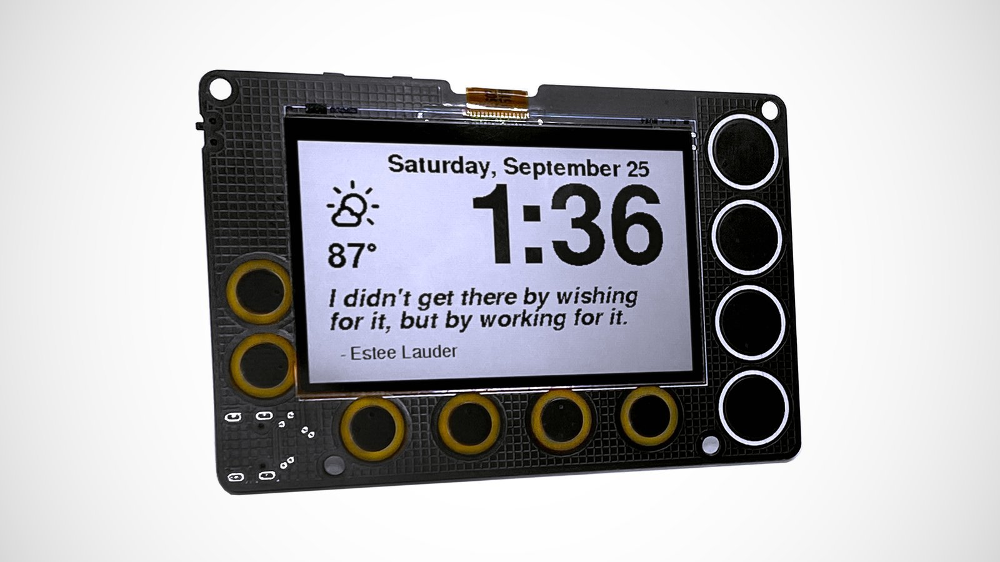

Newt Display Arduino Library
========================================

Newt is a battery-powered, always-on, wall-mountable display that can go online to retrieve weather, calendars, sports scores, to-do lists, quotes…really anything on the Internet! It is powered by an ESP32-S2 microcontroller that you can program with Arduino, CircuitPython, MicroPython, or ESP-IDF.

This library includes the source code used in the Newt display. You can modify this code to customize Newt.

You can read more about Newt at [*https://phambili.tech/newt*](https://phambili.tech/newt)

Planned Engancements/Fixes for next release
---------------------------------------------

Version 1.1.0 - roadmap
- User Option: switch between 12 and 24 hour time format
- User Option: switch between Imperial and Metric units
- User Option: switch switch between default quotes and weather display screen
- User Option: download beta versions of the code
- Arduino library examples (Hello World, Wifi connect to get time, connect to MQTT)

Version 1.1.X - roadmap
- change timezone
- change location
- icon documentation
- service-sde code docuumentation

License Information
-------------------

This product is _**open source**_! 

Please review the LICENSE.md file for license information. 

Distributed as-is; no warranty is given.
